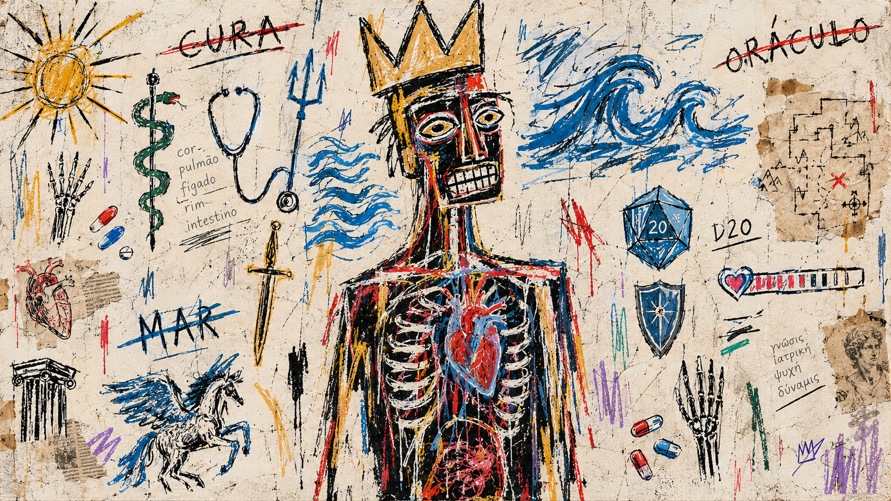

# Oráculo Light

A light Omarchy theme with cool paper surfaces, deep steel-blue text and a clear blue accent.



The preview is original neo-expressionist artwork made for this theme, not a desktop screenshot.

Its dark sibling is [Oráculo](https://github.com/PedroAugustoOK/omarchy-oraculo-theme).

## Install

```bash
omarchy theme install https://github.com/PedroAugustoOK/omarchy-oraculo-light-theme
omarchy theme bg next
```

The first command installs and applies the theme. The second cycles through its wallpapers.

## Included

- `colors.toml` — the theme palette.
- `backgrounds/` — the included wallpapers.
- Root-level appearance files for Omarchy and the supported applications.
- `preview.png` — theme artwork.

## License

MIT. See [LICENSE](LICENSE).
